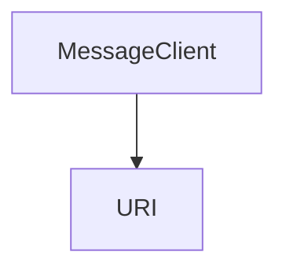

# Messaging Client

This is a simple client to publish and consumes messages from a Message Queue server.

## Features

* Low code to publish and consume messages
* Messages, Queues and Connector objects are decoupled
* Easy to implement new connectors

```text
┌─────────────────┐                  ┌────────────────────────┐
│                 │                  │  Envelope              │
│                 │                  │                        │
│                 │                  │                        │
│                 │                  │   ┌─────────────────┐  │
│                 │   publish()      │   │      Pipe       │  │
│                 ├─────────────────▶│   └─────────────────┘  │
│                 │                  │   ┌─────────────────┐  │
│                 │                  │   │     Message     │  │
│                 │                  │   └─────────────────┘  │
│                 │                  │                        │
│                 │                  └────────────────────────┘
│    Connector    │
│                 │
│                 │
│                 │       consume()     ┌─────────────────┐
│                 │◀────────────────────│      Pipe       │
│                 │                     └─────────────────┘
│                 │
│                 │
│                 │
└─────────────────┘
```

## Implemented Connectors

| Connector | URL / Documentation                                                                      | Composer Package        |
|-----------|------------------------------------------------------------------------------------------|-------------------------|
| Mock      | [docs/mock-connector.md](docs/mock-connector.md)                                         | -                       |
| RabbitMQ  | [https://github.com/byjg/rabbitmq-client](https://github.com/byjg/rabbitmq-client)       | byjg/rabbitmq-client    |
| Redis     | [https://github.com/byjg/redis-queue-client](https://github.com/byjg/redis-queue-client) | byjg/redis-queue-client |

## Usage

### Publish

```php
<?php
// Register the connector and associate with a scheme
ConnectorFactory::registerConnector(MockConnector::class);

// Create a connector
$connector = ConnectorFactory::create(new Uri("mock://local"));

// Create a queue
$pipe = new Pipe("test");
$pipe->withDeadLetter(new Pipe("dlq_test"));

// Create a message
$message = new Message("Hello World");

// Publish the message into the queue
$connector->publish(new Envelope($pipe, $message));
```

### Consume

```php
<?php
// Register the connector and associate with a scheme
ConnectorFactory::registerConnector(MockConnector::class);

// Create a connector
$connector = ConnectorFactory::create(new Uri("mock://local"));

// Create a queue
$pipe = new Pipe("test");
$pipe->withDeadLetter(new Pipe("dlq_test"));

// Connect to the queue and wait to consume the message
$connector->consume(
    $pipe,                                 // Queue name
    function (Envelope $envelope) {         // Callback function to process the message
        echo "Process the message";
        echo $envelope->getMessage()->getBody();
        return Message::ACK;
    },
    function (Envelope $envelope, $ex) {    // Callback function to process the failed message
        echo "Process the failed message";
        echo $ex->getMessage();
        return Message::REQUEUE;
    }
);
```

The consume method will wait for a message and call the callback function to process the message.
If there is no message in the queue, the method will wait until a message arrives.

If you want to exit the consume method, just return `Message::ACK | Message::EXIT` from the callback function.

Possible return values from the callback function:

* `Message::ACK` - Acknowledge the message and remove from the queue
* `Message::NACK` - Not acknowledge the message and remove from the queue. If the queue has a dead letter queue, the message will be sent to the dead letter queue.
* `Message::REQUEUE` - Requeue the message
* `Message::EXIT` - Exit the consume method

## Consumer Client

You can simplify the consume method by using the ConsumerClientTrait. See more details in the [docs/consumer-client-trait.md](docs/consumer-client-trait.md).

## Connectors

The connectors are the classes responsible to connect to the message queue server and send/receive messages.

All connector have the following interface:

```php
<?php
interface ConnectorInterface
{
    public function setUp(Uri $uri);

    public function getDriver();

    public function publish(Envelope $envelope);

    public function consume(Pipe $pipe, \Closure $onReceive, \Closure $onError, $identification = null);
}
```

There is no necessary call the method `getDriver()` because the method publish() and consume() will call it automatically.
Use the method `getDriver()` only if you need to access the connection directly.

## Dependencies



----
[Open source ByJG](http://opensource.byjg.com)
